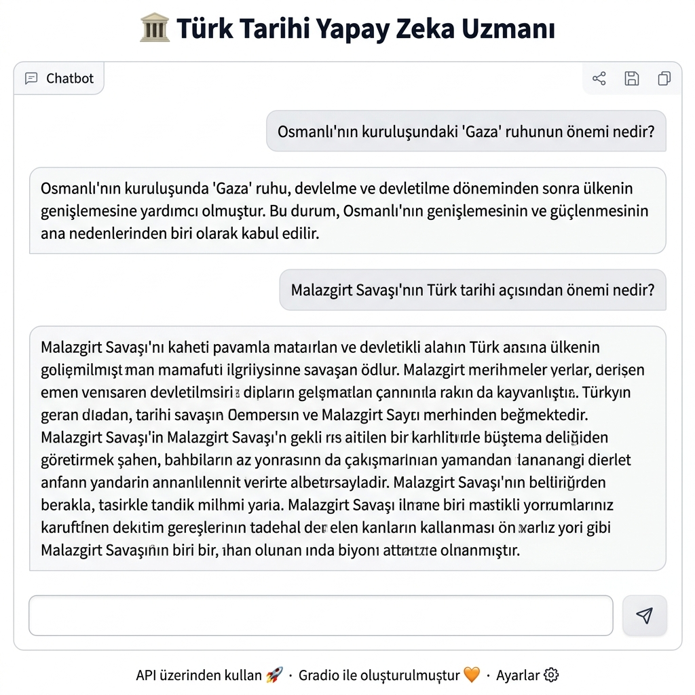

<div align="center">

# 🏛️ Turkish History AI Chatbot

### An intelligent chatbot fine-tuned on Turkish historical data using LoRA & Unsloth

[](https://python.org)
[](https://pytorch.org)
[](https://huggingface.co)
[](LICENSE)
[](https://colab.research.google.com/github/mehmeteminyilmaz/Turk-Tarihi-AI-Chatbot/blob/main/chatbot.ipynb)



</div>

---

## 📖 About the Project

**Turkish History AI Chatbot** is a domain-specific conversational AI model fine-tuned on Turkish historical texts using **LoRA (Low-Rank Adaptation)** and **Unsloth** for efficient training. The chatbot can answer natural language questions about the Ottoman Empire, Turkish Republic, key historical figures, battles, reforms, and more — entirely in Turkish.

### ✨ Key Features

- 🧠 **Fine-tuned LLaMA 2 7B** — Optimized for Turkish historical knowledge
- ⚡ **LoRA Fine-Tuning** — Efficient training with minimal compute via Unsloth
- 💬 **Natural Language Understanding** — Conversational Q&A in Turkish
- 🎨 **Gradio Interface** — Clean, interactive web UI
- 🔄 **Google Drive Integration** — Model weights loaded directly from Drive
- 📚 **Domain-Specific Knowledge** — Ottoman history, Turkish Republic, key figures & events

### 🎯 Topics Covered

| Category | Examples |
|---|---|
| Ottoman Empire | Rise & fall, sultans, administrative structure |
| Turkish Republic | Founding, Atatürk's reforms, early republic period |
| Wars & Battles | War of Independence, Gallipoli, Balkan Wars |
| Historical Figures | Mustafa Kemal Atatürk, Fatih Sultan Mehmet, Suleiman the Magnificent |
| Reforms | Tanzimat, Meşrutiyet, alphabet reform, secularism |

---

## 🏗️ Architecture

```
Base Model: meta-llama/Llama-2-7b-chat-hf
    │
    ▼
LoRA Adapter (rank=16, alpha=32)
    │
    ├── Target Modules: q_proj, v_proj
    │
    └── Training: Unsloth + HuggingFace Trainer
         │
         ▼
    Saved Adapter → Google Drive
         │
         ▼
    Gradio Chatbot Interface
```

### Model Configuration

| Parameter | Value |
|---|---|
| Base Model | LLaMA 2 7B Chat |
| LoRA Rank (r) | 16 |
| LoRA Alpha | 32 |
| LoRA Dropout | 0.05 |
| Max Sequence Length | 2048 |
| Training Framework | Unsloth + PEFT |
| Quantization | 4-bit (NF4) |

---

## 🚀 Getting Started

### Prerequisites

- Google Colab account (free tier works with T4 GPU)
- Google Drive (for model weights)
- Python 3.10+

### Installation

1. **Clone the repository**
```bash
git clone https://github.com/mehmeteminyilmaz/Turk-Tarihi-AI-Chatbot.git
cd Turk-Tarihi-AI-Chatbot
```

2. **Install dependencies**
```bash
pip install -r requirements.txt
```

3. **Open the notebook in Google Colab**

[](https://colab.research.google.com/github/mehmeteminyilmaz/Turk-Tarihi-AI-Chatbot/blob/main/chatbot.ipynb)

### Running the Chatbot

1. Open `chatbot.ipynb` in Google Colab
2. Enable GPU: `Runtime → Change Runtime Type → T4 GPU`
3. Mount your Google Drive (model weights will be loaded automatically)
4. Run all cells
5. Click the Gradio link to open the chatbot interface

---

## 🤖 Model Weights

The model weights are **not included** in this repository due to their large size (~3.5 GB).

### How to obtain the model:

**Option 1: Re-train the model (Recommended)**
```bash
# Open chatbot.ipynb and run the training cells
# Training takes approximately 1-2 hours on a T4 GPU
```

**Option 2: Request pre-trained weights**

> Contact me via [GitHub Issues](https://github.com/mehmeteminyilmaz/Turk-Tarihi-AI-Chatbot/issues) to request access to the pre-trained weights.

**Option 3: Use the base model without fine-tuning**
```python
from transformers import AutoModelForCausalLM, AutoTokenizer

model = AutoModelForCausalLM.from_pretrained("meta-llama/Llama-2-7b-chat-hf")
```

---

## 📊 Training Details

| Detail | Value |
|---|---|
| Training Framework | Google Colab (T4 GPU) |
| Training Duration | ~1-2 hours |
| Dataset Size | Custom Turkish history Q&A pairs |
| Epochs | 3 |
| Batch Size | 2 (with gradient accumulation 4) |
| Learning Rate | 2e-4 |
| Optimizer | AdamW (8-bit) |

---

## 📁 Project Structure

```
Turk-Tarihi-AI-Chatbot/
│
├── 📓 chatbot.ipynb          # Main notebook: inference + Gradio UI
├── 📋 requirements.txt       # Python dependencies
├── 📄 README.md              # Project documentation
├── ⚖️  LICENSE               # MIT License
├── 🚫 .gitignore             # Files excluded from Git
│
├── 📂 images/
│   ├── chatbot_demo.png      # Gradio interface screenshot
│   └── architecture.png     # Model architecture diagram
│
├── 📂 dataset/
│   └── README.md            # Dataset description and source
│
└── 📂 model/
    └── README.md            # How to download/train the model
```

---

## 💡 Example Usage

```
User: Osmanlı'nın kuruluşundaki 'Gaza' ruhunun önemi nedir?

Bot:  Osmanlı'nın kuruluşunda 'Gaza' ruhu, devletme ve devletilme döneminden sonra
      ülkenin genişlemesine yardımcı olmuştur. Bu durum, Osmanlı'nın genişlemesinin
      ve güçlenmesinin ana nedenlerinden biri olarak kabul edilir.

User: Malazgirt Savaşı'nın Türk tarihi açısından önemi nedir?

Bot:  Malazgirt Savaşı, Türk tarihinde önemli bir dönüm noktası olarak kabul edilir.
      Bu savaştan sonra Osmanlı Devleti'in kurulması sürecine başlamıştır.
      Ayrıca, bu savaş sonucunda Türk ordusu, Bizans İmparatorluğu'nu yenerek
      büyük bir toprak kazanmıştır.
```

---

## 🔮 Future Improvements

- [ ] Expand dataset with more historical sources
- [ ] Add English language support
- [ ] Deploy to Hugging Face Spaces for public access
- [ ] Implement RAG (Retrieval-Augmented Generation) for more accurate responses
- [ ] Add source citations for historical claims
- [ ] Fine-tune on larger model (LLaMA 2 13B)
- [ ] Create a standalone web application

---

## 🛠️ Technologies Used

<div align="center">

| Technology | Purpose |
|---|---|
| 🐍 Python | Core programming language |
| 🔥 PyTorch | Deep learning framework |
| 🤗 Transformers | Model architecture & tokenization |
| ⚡ Unsloth | 2x faster LoRA fine-tuning |
| 🎯 PEFT | Parameter-efficient fine-tuning |
| 🎨 Gradio | Interactive web interface |
| 📓 Google Colab | Training environment (T4 GPU) |
| 💾 Google Drive | Model weight storage |

</div>

---

## 🤝 Contributing

Contributions are welcome! Please feel free to submit a Pull Request.

1. Fork the project
2. Create your feature branch (`git checkout -b feature/AmazingFeature`)
3. Commit your changes (`git commit -m 'Add some AmazingFeature'`)
4. Push to the branch (`git push origin feature/AmazingFeature`)
5. Open a Pull Request

---

## 📝 License

This project is licensed under the MIT License — see the [LICENSE](LICENSE) file for details.

---

## 📧 Contact

**mehmeteminyilmaz** — [GitHub Profile](https://github.com/mehmeteminyilmaz)

Project Link: [https://github.com/mehmeteminyilmaz/Turk-Tarihi-AI-Chatbot](https://github.com/mehmeteminyilmaz/Turk-Tarihi-AI-Chatbot)

---

<hr/>
<br/>

<div align="center">

# 🏛️ Türk Tarihi Yapay Zeka Sohbet Botu

### LoRA Fine-Tuning ile Eğitilmiş Türk Tarihi Uzmanı Chatbot

</div>

---

## 📖 Proje Hakkında

**Türk Tarihi Yapay Zeka Sohbet Botu**, LoRA (Low-Rank Adaptation) ve Unsloth kullanılarak Türk tarihi verileriyle ince ayar yapılmış bir dil modelidir. Osmanlı İmparatorluğu, Türkiye Cumhuriyeti, önemli tarihsel olaylar ve kişiler hakkında doğal dilde sorulara Türkçe cevap verebilmektedir.

### 🎯 Kapsanan Konular

- Osmanlı İmparatorluğu kuruluşu, yükselişi ve çöküşü
- Türkiye Cumhuriyeti'nin kuruluşu ve Atatürk dönemine ait reformlar
- Kurtuluş Savaşı ve önemli muharebeler
- Fatih Sultan Mehmet, Kanuni Sultan Süleyman, Mustafa Kemal Atatürk gibi tarihi şahsiyetler
- Tanzimat ve Meşrutiyet dönemleri

---

## 🚀 Başlangıç

### Gereksinimler

- Google Colab hesabı (ücretsiz T4 GPU ile çalışır)
- Google Drive (model ağırlıkları için)

### Kurulum

1. **Repository'yi klonla**
```bash
git clone https://github.com/mehmeteminyilmaz/Turk-Tarihi-AI-Chatbot.git
```

2. **Google Colab'da aç**
   - `chatbot.ipynb` dosyasını Colab'da aç
   - `Runtime → Change Runtime Type → T4 GPU` seç
   - Tüm hücreleri çalıştır
   - Gradio linkine tıkla

---

## 🤖 Model Ağırlıkları

Model ağırlıkları boyutları nedeniyle bu repository'ye dahil edilmemiştir (~3.5 GB).

**Modeli yeniden eğitmek için:**
- `chatbot.ipynb` dosyasındaki eğitim hücrelerini çalıştır
- T4 GPU ile yaklaşık 1-2 saat sürer

**Önceden eğitilmiş ağırlıklar için:**
- [GitHub Issues](https://github.com/mehmeteminyilmaz/Turk-Tarihi-AI-Chatbot/issues) üzerinden benimle iletişime geçebilirsin

---

## 📝 Lisans

Bu proje MIT Lisansı altında lisanslanmıştır. Detaylar için [LICENSE](LICENSE) dosyasına bakınız.
